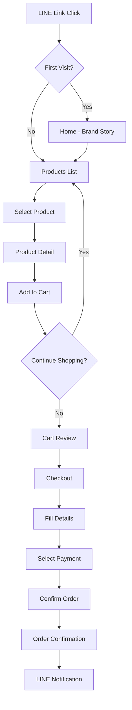
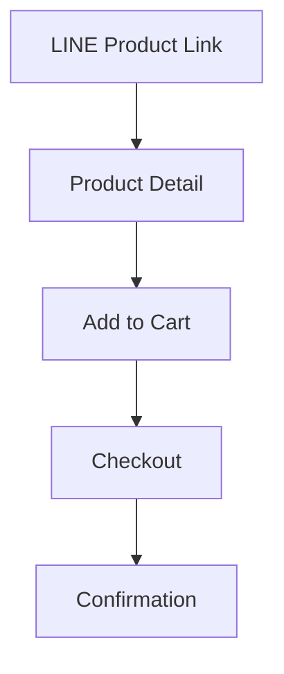

# THANAT-CHA: Complete Architecture & Design Document
## Premium Niche Perfume E-Commerce Web Application

---

# 1) PRODUCT STRATEGY SUMMARY

## Brand Essence
**THANAT-CHA** (ธนัชชา) - A Thai premium niche perfume brand that captures the poetry of scent through minimalist luxury. The name evokes "wealth of tea" or "prosperous essence" - suggesting refined, layered fragrances that tell stories.

## Value Proposition
- **Emotional storytelling over product specs** - Each fragrance evokes a mood, memory, or moment
- **Accessible luxury** - Premium quality without intimidating price points
- **Thai craftsmanship with global aesthetic** - Local production, international design language
- **Simplicity in experience** - No overwhelming choices, curated selection

## Business Model
| Aspect | Strategy |
|--------|----------|
| Sales Channel | Mobile-first web shop + LINE OA integration |
| Payment | QR PromptPay, Bank Transfer (Thai market focus) |
| Fulfillment | Owner-managed, 2-day shipping in Bangkok |
| Inventory | Small batch, rotating seasonal releases |
| Marketing | LINE, Instagram, word-of-mouth, scent discovery events |

## Competitive Differentiation
1. **Quiet luxury positioning** - Unlike loud mass-market perfumes
2. **Mood-first discovery** - Shop by feeling, not just notes
3. **Minimal cognitive load** - Maximum 6 fragrances at a time
4. **LINE-native experience** - Optimized for Thailand's dominant platform

---

# 2) SITEMAP

```
THANAT-CHA
│
├── Home (/) - Brand story + featured scents
│   ├── Hero: Emotional headline
│   ├── Mood selector
│   ├── Featured products (3 max)
│   └── Discovery set CTA
│
├── Products (/products) - Scent collection
│   ├── Filter by mood
│   ├── Product cards
│   └── Discovery set bundle
│
├── Product Detail (/products/:slug)
│   ├── Large imagery
│   ├── Mood story
│   ├── Notes pyramid
│   ├── Size/price selector
│   └── Sticky add-to-cart
│
├── Cart (/cart)
│   ├── Item list with images
│   ├── Quantity controls
│   ├── Summary
│   └── Checkout CTA
│
├── Checkout (/checkout)
│   ├── Customer info (name, phone, address)
│   ├── Payment method
│   ├── Order summary
│   └── Confirmation
│
├── About (/about)
│   ├── Brand story
│   ├── Founder note
│   └── Craft philosophy
│
└── Contact (/contact)
    ├── LINE chat button
    ├── Store locations
    └── FAQ
```

---

# 3) USER FLOW

## Primary Flow: Browse → Purchase



## Secondary Flow: Direct Product Link


## Key Flow Metrics Targets
- **Time to add to cart:** < 30 seconds
- **Checkout steps:** Maximum 3 screens
- **Form fields:** Maximum 6 inputs
- **Total purchase time:** < 2 minutes

---

# 4) WIREFRAMES (Text Layout)

## Home Page (/)

```
┌─────────────────────────┐
│  [Logo: THANAT-CHA]     │  ← Fixed header, minimal
├─────────────────────────┤
│                         │
│    [Full-bleed Image]   │  ← Atmospheric, emotional
│                         │
│   "Scents that whisper  │
│    stories"             │  ← Single poetic headline
│                         │
│    [Explore →]          │  ← One clear CTA
│                         │
├─────────────────────────┤
│  Shop by Mood           │  ← Horizontal scroll
│  [Calm] [Warm] [Wild]   │
├─────────────────────────┤
│                         │
│  Featured               │
│  ┌─────┐  ┌─────┐      │  ← 2-column grid
│  │ IMG │  │ IMG │      │
│  │Name │  │Name │      │
│  │฿Xxx │  │฿Xxx │      │
│  └─────┘  └─────┘      │
│                         │
├─────────────────────────┤
│  Discovery Set          │
│  "Find your scent"      │
│  [฿599 - Shop Now]      │
├─────────────────────────┤
│  [Instagram] [LINE]     │  ← Footer, minimal
└─────────────────────────┘
```

## Product List (/products)

```
┌─────────────────────────┐
│  ←  Our Scents          │  ← Back + Title
├─────────────────────────┤
│  [All] [Calm] [Warm]..  │  ← Mood filter pills
├─────────────────────────┤
│                         │
│  ┌─────────┐ ┌────────┐ │
│  │         │ │        │ │
│  │  IMG    │ │  IMG   │ │  ← Large product cards
│  │         │ │        │ │
│  │ Name    │ │ Name   │ │
│  │ Mood    │ │ Mood   │ │
│  │ ฿Xxx    │ │ ฿Xxx   │ │
│  └─────────┘ └────────┘ │
│                         │
│  ┌─────────┐ ┌────────┐ │
│  │  IMG    │ │  IMG   │ │
│  │ ...     │ │ ...    │ │
│  └─────────┘ └────────┘ │
│                         │
├─────────────────────────┤
│  Discovery Set Banner   │
└─────────────────────────┘
```

## Product Detail (/products/:slug)

```
┌─────────────────────────┐
│  ←                      │  ← Back button only
├─────────────────────────┤
│                         │
│    [Full Image]         │  ← Swipeable gallery
│         ○ ○             │
│                         │
├─────────────────────────┤
│  SCENT NAME             │
│  Mood tag               │
│                         │
│  "Poetic description    │
│   of the scent's        │
│   emotional quality"    │
│                         │
│  Notes                  │
│  Top:     [note] [note] │
│  Middle:  [note] [note] │
│  Base:    [note] [note] │
│                         │
│  Size                     │
│  [10ml] [30ml] [50ml]   │
│                         │
│  ฿1,290                 │
│                         │
│  ─────────────────────  │
│                         │
│  [Story section]        │
│  [Ingredients]          │
│  [Shipping info]        │
│                         │
├─────────────────────────┤
│  ฿1,290      [Add +]    │  ← STICKY: Price + CTA
└─────────────────────────┘
```

## Cart (/cart)

```
┌─────────────────────────┐
│  ←  Your Cart (2)       │
├─────────────────────────┤
│                         │
│  ┌────┐ Scent Name      │
│  │IMG │ 30ml            │
│  │    │ ฿1,290          │
│  └────┘ [-] 1 [+]  ✕    │  ← Quantity + remove
│                         │
│  ─────────────────────  │
│                         │
│  ┌────┐ Scent Name      │
│  │IMG │ Discovery Set   │
│  │    │ ฿599            │
│  └────┘ [-] 1 [+]  ✕    │
│                         │
├─────────────────────────┤
│  Subtotal      ฿1,889   │
│  Shipping      FREE     │
│  ─────────────────────  │
│  Total         ฿1,889   │
│                         │
│  [Checkout →]           │
│                         │
└─────────────────────────┘
```

## Checkout (/checkout)

```
┌─────────────────────────┐
│  ←  Checkout            │
├─────────────────────────┤
│  1. Your Details        │
│  ┌───────────────────┐  │
│  │ Name              │  │
│  └───────────────────┘  │
│  ┌───────────────────┐  │
│  │ Phone             │  │
│  └───────────────────┘  │
│  ┌───────────────────┐  │
│  │ Address           │  │
│  └───────────────────┘  │
│                         │
│  2. Payment             │
│  ○ QR PromptPay         │
│  ○ Bank Transfer        │
│                         │
│  [Review Order →]       │
│                         │
├─────────────────────────┤
│  Order Summary          │
│  2 items         ฿Xxx   │
└─────────────────────────┘
```

## Order Confirmation

```
┌─────────────────────────┐
│                         │
│       ✓                 │
│                         │
│   Thank you             │
│                         │
│   Order #TH-2025-001    │
│                         │
│   We've sent details    │
│   to your LINE          │
│                         │
│   [View Order]          │
│   [Continue Shopping]   │
│                         │
│   ─────────────────     │
│   Payment Instructions  │
│   [QR Code]             │
│   or Bank: XXX-X-XX...  │
│                         │
└─────────────────────────┘
```

---

# 5) DESIGN SYSTEM

## Color Palette

### Light Mode
| Token | Value | Usage |
|-------|-------|-------|
| `--bg-primary` | `#FAFAF9` | Main background (warm white) |
| `--bg-secondary` | `#FFFFFF` | Cards, surfaces |
| `--bg-tertiary` | `#F5F5F4` | Subtle sections |
| `--text-primary` | `#1C1917` | Headlines, important text |
| `--text-secondary` | `#57534E` | Body text |
| `--text-tertiary` | `#A8A29E` | Hints, disabled |
| `--accent` | `#78350F` | Primary CTAs (amber-brown) |
| `--accent-hover` | `#92400E` | Hover states |
| `--border` | `#E7E5E4` | Dividers, borders |
| `--success` | `#15803D` | Success states |
| `--error` | `#DC2626` | Error states |

### Dark Mode
| Token | Value | Usage |
|-------|-------|-------|
| `--bg-primary` | `#0C0A09` | Main background |
| `--bg-secondary` | `#1C1917` | Cards, surfaces |
| `--bg-tertiary` | `#292524` | Subtle sections |
| `--text-primary` | `#FAFAF9` | Headlines |
| `--text-secondary` | `#D6D3D1` | Body text |
| `--text-tertiary` | `#A8A29E` | Hints |
| `--accent` | `#D97706` | Primary CTAs (amber) |
| `--accent-hover` | `#F59E0B` | Hover states |
| `--border` | `#44403C` | Dividers |

### Mood Colors (Subtle Accents)
| Mood | Light | Dark |
|------|-------|------|
| Calm | `#E0F2FE` (sky) | `#0C4A6E` |
| Warm | `#FFEDD5` (orange) | `#7C2D12` |
| Wild | `#FCE7F3` (pink) | `#831843` |
| Fresh | `#D1FAE5` (mint) | `#065F46` |
| Deep | `#E7E5E4` (stone) | `#44403C` |

## Typography

### Font Stack
```css
--font-display: 'Cormorant Garamond', Georgia, serif;
--font-body: 'Inter', -apple-system, BlinkMacSystemFont, sans-serif;
```

### Type Scale (Mobile-first)
| Level | Size | Weight | Usage |
|-------|------|--------|-------|
| Hero | 32px / 2rem | 300 | Home headline |
| H1 | 28px / 1.75rem | 400 | Page titles |
| H2 | 22px / 1.375rem | 500 | Section headers |
| H3 | 18px / 1.125rem | 500 | Card titles |
| Body | 16px / 1rem | 400 | Paragraphs |
| Small | 14px / 0.875rem | 400 | Secondary text |
| Tiny | 12px / 0.75rem | 500 | Labels, tags |
| Price | 20px / 1.25rem | 600 | Prices |

### Typography Rules
- **Line height:** 1.5 for body, 1.2 for headings
- **Letter spacing:** -0.02em for headings (tight)
- **Max line length:** 35 characters for readability
- **All caps:** Only for labels (tracking: 0.1em)

## Spacing System

### Base Unit: 4px
| Token | Value | Usage |
|-------|-------|-------|
| `--space-1` | 4px | Tight gaps |
| `--space-2` | 8px | Icon gaps |
| `--space-3` | 12px | Small padding |
| `--space-4` | 16px | Default padding |
| `--space-5` | 20px | Section gaps |
| `--space-6` | 24px | Card padding |
| `--space-8` | 32px | Large gaps |
| `--space-10` | 40px | Section padding |
| `--space-12` | 48px | Major sections |

### Layout Grid
- **Container max-width:** 480px (mobile-first)
- **Gutter:** 16px
- **Side padding:** 20px

## Components

### Buttons

**Primary Button**
```
Background: var(--accent)
Text: white
Padding: 16px 24px
Border-radius: 8px
Font: 16px, weight 500
Full-width on mobile
```

**Secondary Button**
```
Background: transparent
Border: 1px solid var(--border)
Text: var(--text-primary)
Padding: 12px 20px
Border-radius: 8px
```

**Icon Button**
```
Size: 44px x 44px (touch target)
Background: var(--bg-secondary)
Border-radius: 50%
```

### Cards

**Product Card**
```
Background: var(--bg-secondary)
Border-radius: 12px
Overflow: hidden
Shadow: 0 1px 3px rgba(0,0,0,0.05)
Image aspect: 4:5
Padding: 12px
```

### Form Elements

**Input Field**
```
Height: 52px (thumb-friendly)
Padding: 16px
Border: 1px solid var(--border)
Border-radius: 8px
Font-size: 16px (prevents zoom on iOS)
```

**Quantity Selector**
```
Height: 44px
Buttons: 44px x 44px
Display: flex, center aligned
Border: 1px solid var(--border)
Border-radius: 8px
```

### Navigation

**Bottom Sticky Bar**
```
Position: fixed, bottom: 0
Height: 80px (including safe area)
Background: var(--bg-secondary)
Border-top: 1px solid var(--border)
Padding: 12px 20px
Padding-bottom: env(safe-area-inset-bottom)
```

---

# 6) UX PRINCIPLES FOR MOBILE PERFUME SHOPPING

## 1. Emotional First, Functional Second
- Lead with mood/feeling, not ingredients
- Use atmospheric imagery over product shots
- Copy should evoke, not describe

## 2. Minimize Cognitive Load
- Maximum 6 products visible at once
- No filters beyond mood
- Single path to purchase
- No account creation required

## 3. Thumb-First Design
- All interactive elements minimum 44px
- Primary actions at bottom of screen
- Swipe gestures for image galleries
- Floating action button for cart

## 4. Speed Perception
- Skeleton screens during loading
- Instant feedback on interactions
- Progressive image loading
- No full-page reloads

## 5. Trust Through Transparency
- Clear pricing, no hidden fees
- Real stock numbers
- Estimated delivery dates
- LINE chat for instant support

## 6. LINE-Native Experience
- Deep link from LINE opens seamlessly
- Share product cards back to LINE
- Order confirmations via LINE
- LINE login option (optional)

## 7. Sensory Substitution
Since users can't smell online:
- Detailed note pyramids
- Mood descriptors
- "Similar to" comparisons
- Discovery set for sampling

---

# 7) COPYWRITING EXAMPLES

## Headlines

**Home Hero**
```
"Some scents whisper.
Others linger.
Yours will be remembered."
```

**Discovery Set**
```
"Not sure yet?
Let your skin decide.

Five moments.
One journey.
Find yours."
```

## Product Descriptions

**Example: "After Rain"**
```
The quiet after the storm.
Petrichor rising from warm earth.
A window left open.

For moments of:
Clarity. Stillness. New beginnings.

Notes:
Top: Bergamot, Ozonic accord
Heart: Wet soil, Violet leaf
Base: Cedar, White musk
```

**Example: "Midnight Tea"**
```
A cup forgotten on the windowsill.
Moonlight through steam.
Conversations that lasted until dawn.

For moments of:
Intimacy. Warmth. Quiet luxury.

Notes:
Top: Black tea, Cardamom
Heart: Jasmine, Honey
Base: Sandalwood, Vanilla
```

## Microcopy

**Add to Cart Button States**
- Default: "Add to Bag"
- Loading: "Adding..."
- Success: "Added ✓"
- Out of stock: "Notify Me"

**Checkout**
- "Almost yours"
- "Where shall we send it?"
- "How would you like to pay?"

**Empty States**
- Cart: "Your bag is waiting"
- Favorites: "Save scents for later"

---

# 8) TECH STACK RECOMMENDATION

## Frontend
| Layer | Technology | Rationale |
|-------|------------|-----------|
| Framework | Vanilla JS + Vite | Zero overhead, fast build, easy maintenance |
| Styling | Tailwind CSS v4 | Utility-first, small bundle, dark mode built-in |
| State | LocalStorage + URL params | No complex state management needed |
| Images | Cloudinary / Supabase | Optimization, CDN, low cost |
| Icons | Lucide (tree-shake) | Lightweight, consistent |

## Backend (Phase 1: Low Budget)
| Layer | Technology | Rationale |
|-------|------------|-----------|
| Database | Supabase (PostgreSQL) | Free tier, real-time, auth optional |
| Storage | Supabase Storage | Same platform, image CDN |
| API | Supabase REST/Realtime | Auto-generated, no backend code |
| Hosting | Vercel / Netlify | Free tier, fast CDN, auto-deploy |
| Domain | Namecheap / Cloudflare | ~$10/year |

## Backend (Phase 2: Growth)
| Layer | Technology | When to Switch |
|-------|------------|----------------|
| API | Next.js API Routes | Need custom logic |
| Payments | Stripe Thailand | Volume > 50 orders/month |
| CMS | Sanity / Strapi | Owner needs easier editing |
| Search | Algolia | > 20 products |

## LINE Integration
- **LINE Login** (optional) - One-tap auth
- **LINE Messaging API** - Order notifications
- **LIFF App** - Native-feeling experience in LINE
- **Share Target Picker** - Share products to chats

## Total Estimated Cost (Phase 1)
| Service | Monthly Cost |
|---------|--------------|
| Supabase | $0 (free tier) |
| Vercel | $0 (free tier) |
| Domain | ~$10/year |
| **Total** | **~$10/year** |

---

# 9) DATABASE SCHEMA

## Products Table
```sql
create table products (
  id uuid primary key default gen_random_uuid(),
  slug text unique not null,
  name text not null,
  tagline text, -- Short mood description
  description text, -- Full story
  mood text not null, -- calm, warm, wild, fresh, deep
  top_notes text[],
  middle_notes text[],
  base_notes text[],
  images text[], -- Array of image URLs
  is_bestseller boolean default false,
  is_active boolean default true,
  created_at timestamp default now(),
  updated_at timestamp default now()
);
```

## Product Variants Table
```sql
create table product_variants (
  id uuid primary key default gen_random_uuid(),
  product_id uuid references products(id) on delete cascade,
  size text not null, -- 10ml, 30ml, 50ml
  price integer not null, -- Store in smallest unit (satang)
  stock integer default 0,
  sku text unique,
  is_active boolean default true
);
```

## Orders Table
```sql
create table orders (
  id uuid primary key default gen_random_uuid(),
  order_number text unique not null, -- TH-2025-00001
  customer_name text not null,
  customer_phone text not null,
  customer_address text not null,
  payment_method text not null, -- promptpay, bank_transfer
  payment_status text default 'pending', -- pending, paid, failed
  order_status text default 'pending', -- pending, confirmed, shipped, delivered, cancelled
  subtotal integer not null,
  shipping_cost integer default 0,
  total integer not null,
  notes text,
  created_at timestamp default now(),
  updated_at timestamp default now()
);
```

## Order Items Table
```sql
create table order_items (
  id uuid primary key default gen_random_uuid(),
  order_id uuid references orders(id) on delete cascade,
  product_id uuid references products(id),
  variant_id uuid references product_variants(id),
  product_name text not null, -- Snapshot
  variant_size text not null, -- Snapshot
  price integer not null, -- Snapshot
  quantity integer not null,
  total integer not null
);
```

## Discovery Sets Table
```sql
create table discovery_sets (
  id uuid primary key default gen_random_uuid(),
  name text not null,
  description text,
  price integer not null,
  images text[],
  included_product_ids uuid[],
  is_active boolean default true
);
```

---

# 10) API STRUCTURE

## REST Endpoints

### Products
```
GET    /api/products              # List all active products
GET    /api/products?mood=calm    # Filter by mood
GET    /api/products/:slug        # Get single product with variants
```

### Cart (Client-side only)
```javascript
// LocalStorage structure
{
  items: [
    {
      productId: "uuid",
      variantId: "uuid",
      quantity: 1,
      addedAt: "timestamp"
    }
  ]
}
```

### Orders
```
POST   /api/orders                # Create order
GET    /api/orders/:id            # Get order (with phone verification)
PATCH  /api/orders/:id/payment    # Update payment status (webhook)
```

### Webhooks
```
POST   /webhooks/line             # LINE message events
POST   /webhooks/payment          # Payment provider callbacks
```

## Supabase Realtime Subscriptions
```javascript
// Stock updates
supabase
  .channel('stock')
  .on('postgres_changes', { event: 'UPDATE', schema: 'public', table: 'product_variants' }, callback)
  .subscribe();
```

---

# 11) FOLDER STRUCTURE

```
thanat-cha-shop/
├── public/
│   ├── fonts/
│   ├── favicon.ico
│   └── manifest.json
├── src/
│   ├── components/
│   │   ├── ui/              # Reusable UI components
│   │   │   ├── Button.js
│   │   │   ├── Input.js
│   │   │   ├── Card.js
│   │   │   └── QuantitySelector.js
│   │   ├── layout/          # Layout components
│   │   │   ├── Header.js
│   │   │   ├── BottomNav.js
│   │   │   └── Container.js
│   │   └── product/         # Product-specific
│   │       ├── ProductCard.js
│   │       ├── ProductGallery.js
│   │       ├── NotesPyramid.js
│   │       └── MoodBadge.js
│   ├── pages/
│   │   ├── Home.js
│   │   ├── ProductList.js
│   │   ├── ProductDetail.js
│   │   ├── Cart.js
│   │   ├── Checkout.js
│   │   ├── OrderConfirmation.js
│   │   ├── About.js
│   │   └── Contact.js
│   ├── lib/
│   │   ├── supabase.js      # Database client
│   │   ├── cart.js          # Cart logic
│   │   └── utils.js         # Helpers
│   ├── styles/
│   │   ├── main.css
│   │   └── variables.css
│   ├── app.js               # App initialization
│   └── router.js            # Simple router
├── index.html
├── vite.config.js
├── tailwind.config.js
├── package.json
└── README.md
```

---

# 12) STARTER CODE

See generated files:
- [`index.html`](index.html)
- [`src/styles/main.css`](src/styles/main.css)
- [`src/app.js`](src/app.js)

---

# 13) PERFORMANCE OPTIMIZATION TIPS

## Image Optimization
- Use WebP format with JPEG fallback
- Implement lazy loading with blur-up placeholder
- Serve responsive images (srcset)
- Maximum image width: 800px for mobile
- Use Cloudinary for on-the-fly optimization

## Code Optimization
- Tree-shake unused code
- Code-split by route
- Inline critical CSS
- Defer non-critical JavaScript

## Caching Strategy
```javascript
// Service Worker for offline cart
self.addEventListener('fetch', (event) => {
  // Cache product images
  // Network-first for API calls
  // Cache-first for static assets
});
```

## Core Web Vitals Targets
| Metric | Target |
|--------|--------|
| LCP (Largest Contentful Paint) | < 2.5s |
| FID (First Input Delay) | < 100ms |
| CLS (Cumulative Layout Shift) | < 0.1 |
| TTFB (Time to First Byte) | < 600ms |

## LINE Browser Specific
- Test in LINE's in-app browser
- Handle LINE's viewport quirks
- Support LINE's share functionality
- Optimize for LINE's caching behavior

---

# 14) CONVERSION OPTIMIZATION TIPS

## Friction Reduction
1. **Guest checkout only** - No registration required
2. **Auto-fill address** - From phone number lookup (if available)
3. **One-tap payment** - QR code display immediately
4. **Sticky CTA** - Add to cart always visible
5. **Stock urgency** - "Only 3 left" for low stock

## Trust Signals
- Real product photos (not renders)
- Customer reviews with photos
- Secure payment badges
- Clear return policy
- LINE chat for instant questions

## Psychological Triggers
- **Scarcity:** Limited editions, low stock warnings
- **Social proof:** "Trending now", review count
- **Anchoring:** Show discovery set savings
- **Reciprocity:** Free sample with order

## A/B Test Ideas
1. Hero image vs. video
2. Mood selector placement
3. "Add to bag" vs. "Add to cart"
4. Single-page vs. multi-step checkout
5. Discovery set pricing (฿499 vs. ฿599)

## LINE-Specific Conversions
- Rich product cards when shared
- LINE notification for abandoned cart
- Exclusive LINE-only discounts
- Easy "Share to story" functionality

---

# 15) FUTURE SCALING ROADMAP

## Phase 1: MVP (Months 1-2)
- [x] Basic product catalog
- [x] Cart and checkout
- [x] PromptPay/Bank transfer
- [x] LINE notifications
- [x] Mobile-first design

## Phase 2: Optimization (Months 3-4)

- [ ] Admin dashboard for owner (simple CRUD backoffice, NOT analytics)
    - manage products (add/edit/delete)
    - update price & stock
    - upload images
    - view orders list
    - update order status
    - low stock alerts
    - simple table UI only
    - no charts
    - no complex roles
    - no heavy frameworks

- [ ] Inventory management (stock alerts + manual update only)
- [ ] Order tracking (status: pending/paid/shipped/cancelled)
- [ ] Basic analytics (daily orders + revenue only, simple numbers)
- [ ] Customer reviews (simple text reviews only)
- [ ] Discovery set bundles

## Phase 3: Growth (Months 5-6)
- [ ] Stripe integration for cards
- [ ] LINE LIFF app
- [ ] Membership/loyalty program
- [ ] Referral system
- [ ] Email marketing integration
- [ ] SMS notifications

## Phase 4: Expansion (Months 7-12)
- [ ] Subscription model
- [ ] Scent quiz/recommendation engine
- [ ] AR try-on (virtual scent visualization)
- [ ] International shipping
- [ ] Multi-language support
- [ ] POS integration for physical stores

## Technical Debt to Address
1. Migrate to Next.js for SEO
2. Implement proper caching layer
3. Add comprehensive error tracking
4. Set up automated testing
5. Performance monitoring

---

*Document Version: 1.0*
*Created: January 2026*
*For: THANAT-CHA Premium Perfume*
